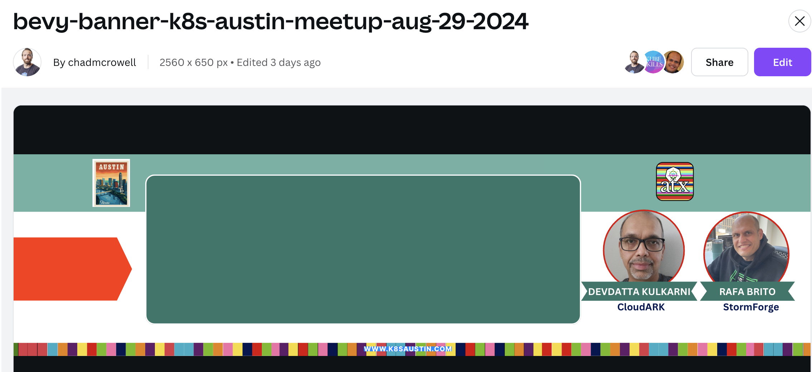
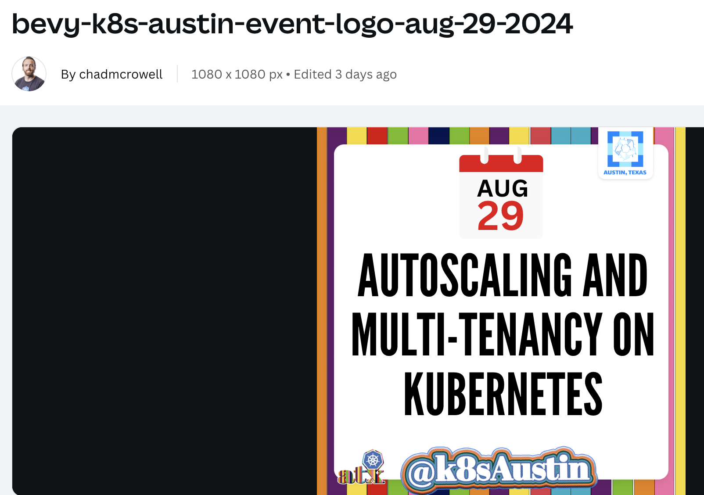

# How to Create an Event

This is the rough steps in how to create a meetup event from scratch.

## Secure the Speakers and Officially Approve Them
Make sure speakers submit their talks and bios via [Sessionize](https://sessionize.com/app/organizer/event/13876).
Case by case, we can volunteer to do on their behalf.
Coordinate with speaker the date and venue, confirming their availability.
Upon their agreement, via sessionize tab.
This is particular important if speakers want to keep a record of their talks (it counts towards contribution to the community).

## Create Art
We need three pieces of art for the event:
1. An event banner for bevy
1. An event logo for bevy and meetup

Login on [Canva](https://canva.com) and look for "KubeSkill" folder.

For #1, it is a `2560 x 650 px` banner, look for files named `bevy-banner-k8s-austin-meetup-<date>`, pick one and save as and edit the speakers' name, picture and companies.
*Leave the middle of the banner blank*.
Example

For #2, it is a `1080 x 1080 px` tile for the logo. Look for files named `bevy-k8s-austin-event-logo-<date>`.
Same drill, pick one, save as and edit it with the title and date .
Example:

## Create a Bevy event
Log on [Bevy](https://community.cncf.io/accounts/dashboard/#/chapter-177/events-Live), make sure you have access to the Kubernetes Austin dashboard: 

Click at `New Event -> Meetup` and follow the prompts.
Copy and paste from the previous event, we always link the speaker's name to their LinkedIn profile.
If the event is being hosted at Capital Factory, please make sure their logo and address are displayed (for contractual reasons).
Desirably, if you have the name of the room, make sure it is displayed correctly and prominently.
Upload the event banner and thumbnail you made previously.
Add all the co-organizers as host. Add sponsors (whoever is paying for foods and drinks).
Use the option to RSVP, we usually cap to 50 people.

## Create a k8saustin short url

Once you have a URL for the event, go to `https://github.com/chadmcrowell/k8saustincom/blob/main/_redirects` and edit file. Test it.

## Create a Meetup Event

Log on [meetup](https://www.meetup.com/home/), you should see the dashboard like below and click at `Create Event`.
Copy and paste from a previous event, we always put a link to Bevy, since this is a legacy platform.
Make sure you add topics such as `kuberenetes, cloud native, open source`.

## Divulge the event

[Via Buffer](posting-on-buffer.md).
